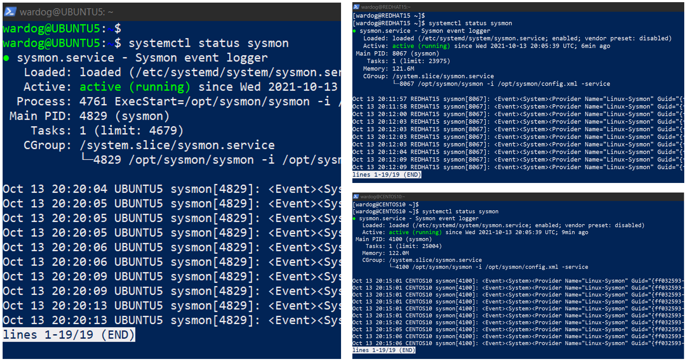
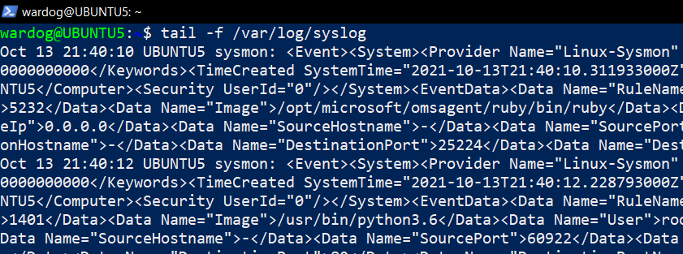
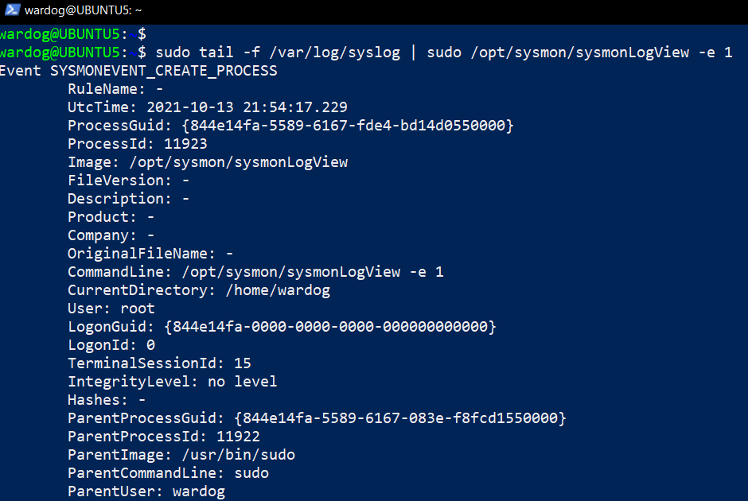
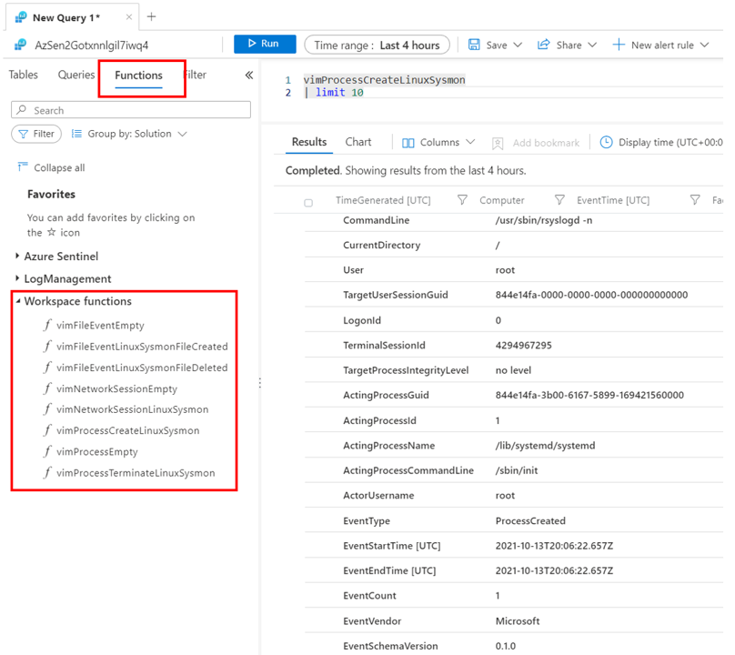

# Sysmon For Linux Lab Environment

[](https://portal.azure.com/#create/Microsoft.Template/uri/https%3A%2F%2Fraw.githubusercontent.com%2FOTRF%2FAzure-Sentinel2Go%2Fmaster%2Fgrocery-list%2FLinux%2Fdemos%2FSysmon-For-Linux%2Fazuredeploy.json/createUIDefinitionUri/https%3A%2F%2Fraw.githubusercontent.com%2FOTRF%2FAzure-Sentinel2Go%2Fmaster%2Fgrocery-list%2FLinux%2Fdemos%2FSysmon-For-Linux%2Fuidefinition.json)

## Metadata

* **Author:** [Roberto Rodriguez (@Cyb3rWard0g)](https://twitter.com/Cyb3rWard0g)
* **Deployment time:** 5mins
* **Initial time for log collection (Syslog):** 5-10 mins

## Grocery Items

* Azure Sentinel
    * Would you like to Bring-Your-Own Azure Sentinel?.
    * If so, set the `workspaceId` and `workspaceKey` parameters of your own workspace.
* Linux VMs
    * Distro: `Ubuntu 18.04.6 LTS` - Kernel release: `5.4.0-1059-azure `
    * Distro: `Centos 8.2.2004` - Kernel release: `4.18.0-193.28.1.el8_2.x86_64`
    * Distro: `Red Hat 8.2` - Kernel release: `4.18.0-193.65.2.el8_2.x86_64`
* [Log Analytics Agent for Linux](https://github.com/microsoft/OMS-Agent-for-Linux) installed
    * It connects to the Microsoft Log Analytics workspace defined in the template.
* [Syslog Data Connector](https://docs.microsoft.com/en-us/azure/sentinel/connect-syslog) enabled
* Linux Syslog Facilities collected
    * `user`
* [Sysmon for Linux installed]()
    * [Sysmon for Linux installer]()
    * [Sysmon configuration]()

## Validate Environment

ssh to boxes deployed and confirm the `Sysmon` service is running:

```bash
systemctl status sysmon
```



## Explore Syslog Events

You can explore Sysmon events from the Syslog log. 

```bash
tail –f /var/log/Syslog 
```



## Explore Sysmon Events via sysmonLogView 

Sysmon also comes with a binary named sysmonLogView to explore sysmon events in a friendly format. Run the following commands to explore Sysmon event id 1 (ProcessCreate) events locally: 

```bash
sudo tail -f /var/log/syslog | sudo /opt/sysmon/sysmonLogView -e 1 
```



## Explore Events in Azure Sentinel

You can query Sysmon for Linux logs by using the Syslog table with the following Kusto query: 

```
Syslog 
| extend EventID = parse_xml(SyslogMessage).Event.System.EventID 
| extend EventData = parse_xml(SyslogMessage).Event.EventData.Data 
| mv-expand bagexpansion=array EventData 
| evaluate bag_unpack(EventData) 
| extend Key=tostring(['@Name']), Value=['#text'] 
| evaluate pivot( 
    Key, any(Value), TimeGenerated, TenantId, SourceSystem, 
    EventID, Computer, Facility, SeverityLevel, HostIP, MG, Type, _ResourceId 
) 
| summarize count() by tostring(EventID) 
```

Additionally, as part of the [ASIM](https://docs.microsoft.com/en-us/azure/sentinel/normalization-content) (Azure Sentinel Information Model) project, we have created parsers for [Sysmon for Linux](https://github.com/Azure/Azure-Sentinel/tree/master/Parsers/ASim%20Sysmon%20for%20Linux). The parsers get imported automatically by the template we use to deploy the lab environment. Therefore, you can simply use the parsers available under **Functions** > **Workspace functions**:

```
VimProcessCreateLinuxSysmon 
| limit 10
```


